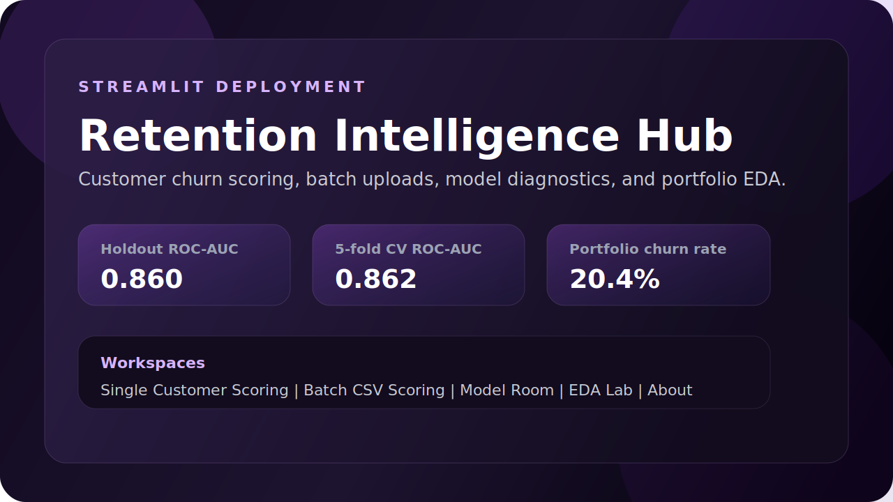

# Retention Intelligence Hub

<p align="center">
  <a href="https://churn-01.streamlit.app/"></a>
  
  
  
  
</p>

<p align="center">
  Streamlit application for customer churn prediction with single-customer scoring, batch CSV uploads,
  model diagnostics, and exploratory churn analysis built from the bank customer churn dataset.
</p>

<p align="center">
  <strong><a href="https://churn-01.streamlit.app/">Launch the live app</a></strong>
</p>

<p align="center">
  <a href="https://churn-01.streamlit.app/"></a>
</p>

## Live App

### [Open the deployed Streamlit app](https://churn-01.streamlit.app/)

If the app has just been updated, give Streamlit a minute to finish rebuilding before refreshing the page.

## App Preview

<p align="center">
  <a href="https://churn-01.streamlit.app/">
    
  </a>
</p>

## What the App Does

- Scores churn risk for a single customer from a guided form
- Scores batch CSV uploads and returns downloadable predictions
- Shows holdout and cross-validation model metrics
- Explains feature importance and pipeline choices in the Model Room
- Provides interactive EDA views for churn patterns, geography, age, balance, and product behavior

## Local Run

```bash
python3 -m pip install -r requirements.txt
python3 train.py
streamlit run streamlit_app.py
```

## Expected Batch Upload Columns

```text
CreditScore, Age, Tenure, Balance, NumOfProducts, HasCrCard, IsActiveMember, EstimatedSalary, Geography, Gender
```

Extra columns are ignored. If `Exited`, `RowNumber`, `CustomerId`, or `Surname` are present, the scoring pipeline drops them automatically.

## Project Structure

- `app.py` - Streamlit interface
- `streamlit_app.py` - deployment entrypoint
- `train.py` - rebuilds the model artifact
- `src/modeling.py` - preprocessing, training, evaluation, and scoring helpers
- `artifacts/churn_model.joblib` - saved production model
- `.streamlit/config.toml` - Streamlit configuration

## Model Notes

The production pipeline drops identifier leakage fields, one-hot encodes categorical columns, uses a class-weighted `RandomForestClassifier`, and reports both holdout ROC-AUC and 5-fold cross-validation ROC-AUC.

## Dataset

The app uses `Churn_Modelling.csv`, with `Exited` as the churn target.
